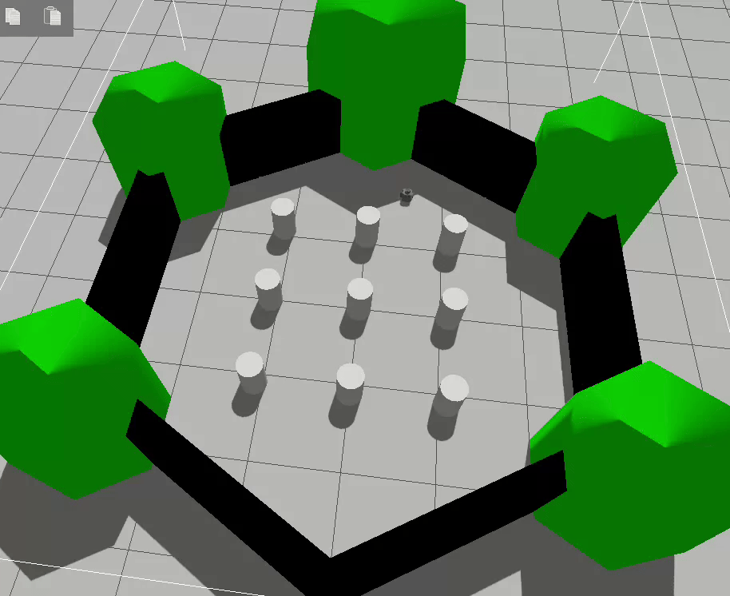
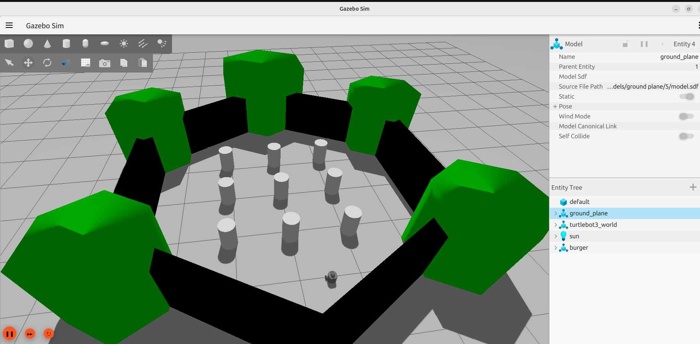
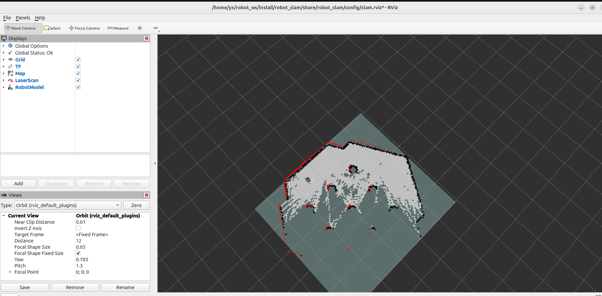
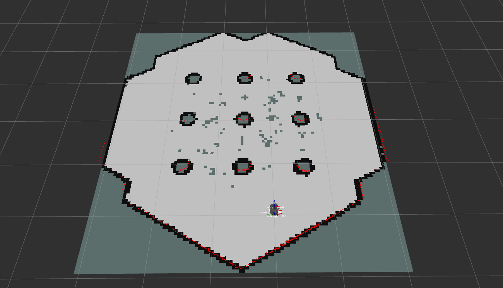
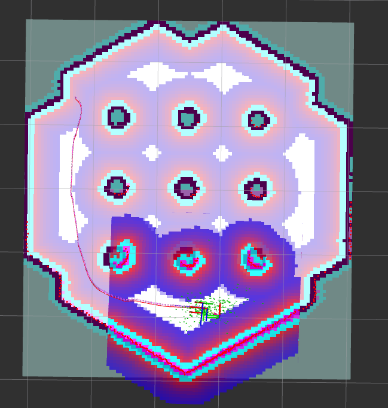
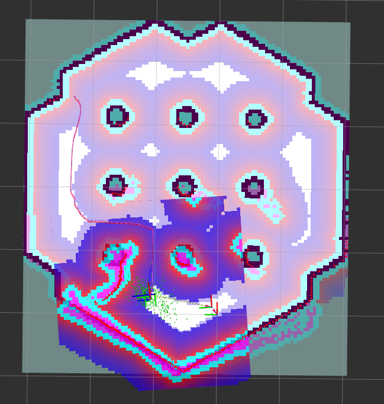
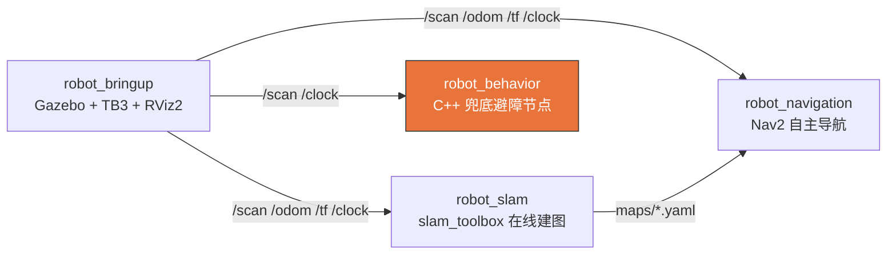

# 基于 ROS2 的移动机器人仿真环境搭建与导航实现

> Mobile Robot Simulation, SLAM & Navigation on **ROS2 Jazzy + Gazebo Harmonic**

一个**可运行 / 可演示 / 可扩展**的移动机器人导航 MVP：在 Gazebo Harmonic 中起 TurtleBot3 burger 仿真，用 slam_toolbox 在线建图，用 Nav2 做自主导航与动态避障，并自研一个 **Modern C++（rclcpp）** 节点做 LiDAR 兜底避障巡航。全流程 `ros2 launch` 一键复现。



> TurtleBot3 burger 在 Gazebo Harmonic 六边形竞技场内运行。完整端到端流程见下方截图与 [§5 演示步骤](#5-演示步骤)。

### 端到端流程一览

| ① 仿真启动 | ② SLAM 建图中 | ③ 建图完成 |
|:---:|:---:|:---:|
|  |  |  |
| **④ Nav2 点目标导航** | **⑤ 动态避障 replan** | **⑥ C++ 兜底巡航** |
|  |  |  |

---

## 1. 项目简介

3 天交付的 robotics demo，聚焦"移动机器人导航"主线，串起一条完整故事线：

**仿真启动 → SLAM 建图 → Nav2 自主导航 → 动态避障 → C++ 兜底巡航**

工程上拆成 4 个解耦的 ROS2 包，每个包 `launch` 一键启动；C++ 节点遵循 Modern C++ 实践（RAII / smart pointer / 逻辑与管线分离 / GTest 覆盖）。

---

## 2. 技术栈

| 组件 | 选型 | 说明 |
|------|------|------|
| OS | Ubuntu 24.04 | — |
| ROS2 | **Jazzy** (LTS) | 维护至 2029 |
| 仿真 | **Gazebo Harmonic** (gz-sim) | 经 `ros_gz_bridge` 与 ROS2 互通 |
| 可视化 | RViz2 | — |
| 机器人 | **TurtleBot3 burger** | 自带 2D LiDAR |
| 核心节点 | **Modern C++ (C++17 / rclcpp)** | 库/可执行分离 + GTest |
| 构建 | colcon + ament_cmake | — |
| SLAM | slam_toolbox | 在线异步建图（lifecycle） |
| 导航 | Nav2 (nav2_bringup) | 仅调参，不重写 planner/controller |

---

## 3. 系统架构

四个自研包按"仿真 → 建图 → 导航 → 行为"分层，互不耦合。完整 mermaid 节点拓扑、topic 数据流、C++ 节点内部数据流见 **[docs/architecture.md](docs/architecture.md)**。



---

## 4. 快速开始

### 4.1 安装依赖（apt）

```bash
sudo apt update && sudo apt install -y \
  ros-jazzy-desktop \
  ros-jazzy-ros-gz \
  ros-jazzy-turtlebot3 \
  ros-jazzy-turtlebot3-simulations \
  ros-jazzy-slam-toolbox \
  ros-jazzy-navigation2 \
  ros-jazzy-nav2-bringup
```

### 4.2 环境变量（写入 ~/.bashrc）

```bash
echo 'source /opt/ros/jazzy/setup.bash' >> ~/.bashrc
echo 'export TURTLEBOT3_MODEL=burger' >> ~/.bashrc
source ~/.bashrc
```

### 4.3 获取并构建 workspace

```bash
# 已在 ~/robot_ws 则跳过 clone
cd ~/robot_ws
rosdep install --from-paths src --ignore-src -r -y    # 补齐源码依赖
colcon build --symlink-install
source install/setup.bash
```

### 4.4 一键起仿真验证

```bash
ros2 launch robot_bringup sim.launch.py
```

看到 TurtleBot3 burger 出现在六边形竞技场、RViz2 显示 LaserScan，即环境就绪。

> 每开一个新终端都需 `cd ~/robot_ws && source install/setup.bash`。

---

## 5. 演示步骤

按顺序跑通建图 → 导航 → 避障三段。完整录屏分镜见 **[docs/demo_script.md](docs/demo_script.md)**。

### 5.1 SLAM 建图（M3）

```bash
# 终端1：仿真
ros2 launch robot_bringup sim.launch.py

# 终端2：在线建图
ros2 launch robot_slam slam.launch.py

# 终端3：键盘遥控绕场建图
ros2 run turtlebot3_teleop teleop_keyboard

# 建好后保存地图（已提供 maps/turtlebot3_world.*，可跳过）
ros2 run nav2_map_server map_saver_cli -f ~/robot_ws/maps/turtlebot3_world
```

| 建图进行中 | 建图完成 |
|:---:|:---:|
|  |  |

### 5.2 Nav2 自主导航 + 动态避障（M4）

```bash
# 终端1：仿真
ros2 launch robot_bringup sim.launch.py

# 终端2：Nav2（默认加载 M3 地图）
ros2 launch robot_navigation nav.launch.py
```

在 RViz2 中：先用 **2D Pose Estimate** 给初始位姿 → 用 **Nav2 Goal** 点目标，机器人自主规划路径并行驶到达。
在 Gazebo 里临时 spawn 一个箱子挡在路径上，Nav2 会实时 **replan** 绕行。

| Nav2 点目标导航 | 动态避障 replan |
|:---:|:---:|
|  |  |

### 5.3 C++ 兜底避障巡航（M5）

```bash
# 终端1：仿真
ros2 launch robot_bringup sim.launch.py

# 终端2：C++ 避障节点
ros2 launch robot_behavior behavior.launch.py
```

机器人开阔时以 `cruise_speed` 匀速前进，正前方 `front_sector_deg` 扇区内探测到 < `stop_distance` 的障碍即原地停转避让。参数可在 `src/robot_behavior/config/obstacle_avoider.yaml` 调整，或 `params_file:=<path>` 覆盖。


运行 C++ 单元测试：

```bash
colcon test --packages-select robot_behavior
colcon test-result --verbose
```

---

## 6. 项目亮点

- **一键复现**：每个能力模块独立 `ros2 launch`，命令可直接复制运行，无隐藏手动步骤。
- **Modern C++ 工程化**：`robot_behavior` 把纯决策逻辑 `computeCommand(scan, params)` 拆成独立库，与节点/IO 解耦——纯函数无需起节点即可被 **4 个 GTest 用例**（开阔直行 / 正前停转 / 侧方忽略 / inf-nan 过滤）直接断言；全程 RAII + `SharedPtr`，无裸 `new/delete`；通过 ament lint。
- **贴合真实环境的细节把控**：`/cmd_vel` 采用 **TwistStamped**（匹配 TB3 Harmonic bridge，发普通 Twist 机器人不动，见 [DECISIONS.md](DECISIONS.md) D010）；slam_toolbox 按官方 LifecycleNode 模式启动以正确加载参数。
- **清晰的工程结构**：4 个职责单一的包 + `maps/` + `docs/`（架构图、分镜）+ 决策留痕（DECISIONS.md）+ 进度看板（PROJECT_STATE.md）。
- **只调参不造轮子**：SLAM / 导航直接复用 slam_toolbox / Nav2，仅维护参数 yaml，把自研精力集中在 C++ 行为节点。

---

## 7. 后续可扩展方向（Roadmap）

> 以下为**规划方向**（当前 demo 未实现），体现可扩展性：

- **视觉感知**：接入相机话题 + YOLO / 检测分割，做语义导航、目标搜索。
- **VLA / 具身大模型集成**：将语言指令（"去厨房拿杯子"）映射为 Nav2 目标 + 行为树，打通感知-决策-动作闭环。
- **行为层增强**：把 C++ 避障节点升级为 Nav2 BT 自定义行为 / recovery，或引入局部 DWB 调参对比。
- **多机器人 / fleet**：扩展到多 TB3 协同与任务分配。
- **真机部署**：从仿真迁移到实体 TurtleBot3，做 sim-to-real 标定与验证。

---

## 附：目录结构

```
robot_ws/
├── src/
│   ├── robot_bringup/      # M2 仿真一键启动
│   ├── robot_slam/         # M3 slam_toolbox 建图
│   ├── robot_navigation/   # M4 Nav2 导航
│   └── robot_behavior/     # M5 Modern C++ 避障节点 (+ GTest)
├── maps/                   # M3 产出地图
├── media/                  # 截图 / demo 视频
├── docs/                   # 架构图 + 录屏分镜
├── CLAUDE.md               # 项目协同约定
├── DECISIONS.md            # 关键技术决策记录
├── PROJECT_STATE.md        # 进度看板
└── README.md               # 本文件
```
