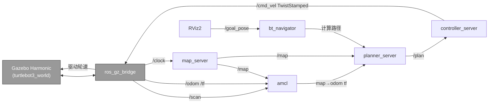
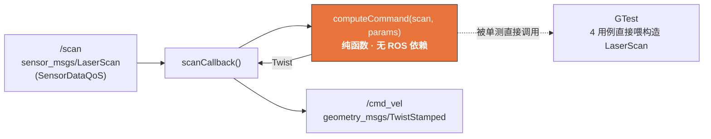

# 系统架构 — robot_ws

> 基于 ROS2 Jazzy + Gazebo Harmonic 的移动机器人仿真 / SLAM / 导航 / 避障一体化 workspace。

---

## 1. 包（package）拓扑

四个自研包，按"仿真 → 建图 → 导航 → 行为"的能力分层，全部以 launch 一键启动，互不耦合。

```mermaid
graph TD
    subgraph workspace["robot_ws (colcon workspace)"]
        BR["robot_bringup<br/>Gazebo + TB3 + RViz2 一键起仿真"]
        SL["robot_slam<br/>slam_toolbox 在线建图 (lifecycle)"]
        NV["robot_navigation<br/>Nav2 bringup + TB3 burger 参数"]
        BH["robot_behavior<br/>Modern C++ 避障巡航节点"]
    end

    BR -->|提供 /scan /odom /tf /clock| SL
    BR -->|提供 /scan /odom /tf /clock| NV
    BR -->|提供 /scan /clock| BH
    SL -->|产出 maps/*.{pgm,yaml}| NV

    classDef cpp fill:#e8743b,stroke:#333,color:#fff;
    classDef py fill:#3b78e8,stroke:#333,color:#fff;
    class BH cpp;
    class BR,SL,NV py;
```

| 包 | 语言 | 角色 | 关键产出 |
|----|------|------|----------|
| `robot_bringup` | launch (Py) | 仿真底座 | `sim.launch.py`：Gazebo Harmonic + TB3 burger + RViz2 |
| `robot_slam` | launch (Py) | 在线建图 | `slam.launch.py`（LifecycleNode）+ `maps/turtlebot3_world.{pgm,yaml}` |
| `robot_navigation` | launch (Py) | 自主导航 | `nav.launch.py`（包装 nav2_bringup）+ `nav2_params.yaml` |
| `robot_behavior` | **C++17 (rclcpp)** | 安全兜底 | `obstacle_aware_cruise` 节点 + 纯逻辑库 + GTest |

---

## 2. 运行时话题数据流（导航场景）

以"Nav2 自主导航"为例，展示节点与 topic / tf 的连接关系。Gazebo Harmonic 通过 `ros_gz_bridge` 与 ROS2 互通；注意 `/cmd_vel` 为 **TwistStamped**（与 TB3 Harmonic bridge 一致，见 DECISIONS D010）。



---

## 3. C++ 核心节点内部数据流（robot_behavior）

`obstacle_aware_cruise` 是一个**安全兜底巡航节点**：开阔则匀速前进，正前方探测到障碍即原地停转避让。工程上刻意把"纯决策逻辑"与"ROS 管线"分离，便于单元测试。



**决策逻辑**：取正前方 `front_sector_deg`（默认 60°）扇区内最近障碍距离；过滤 `inf/nan` 无效点；最近距离 < `stop_distance`（0.5 m）→ 输出 `(linear=0, angular=turn_speed)` 停转避让，否则 `(linear=cruise_speed, angular=0)` 匀速巡航。

**可调参数**（`config/obstacle_avoider.yaml`）：

| 参数 | 默认 | 含义 |
|------|------|------|
| `front_sector_deg` | 60.0 | 监视的正前方锥角 [deg] |
| `stop_distance` | 0.5 | 触发停转的障碍距离阈值 [m] |
| `cruise_speed` | 0.15 | 开阔时前进线速度 [m/s] |
| `turn_speed` | 0.6 | 避障时偏航角速度 [rad/s] |

**Modern C++ 工程要点**：库（`obstacle_avoider_lib` 纯逻辑）/ 可执行（节点 + main）分离；全程 RAII + `SharedPtr`，无裸 `new/delete`；`computeCommand` 为纯函数，4 个 GTest 用例（开阔直行 / 正前停转 / 侧方忽略 / inf-nan 过滤）无需起节点即可断言。
